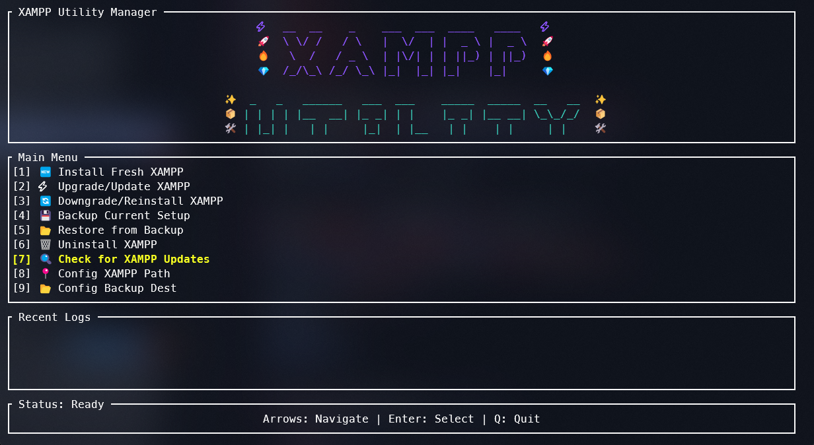

<div align="center">

# 🚀 Automated XAMPP Utility Manager (Rust Edition)


_A high-performance, standalone Text User Interface (TUI) application for safely and efficiently managing your XAMPP server environments._

</div>

---

## 🌟 Overview

**Automated XAMPP Utility Manager** has been rewritten from the ground up in **Rust**. It provides a faster, more robust, and highly interactive terminal experience for managing your XAMPP installations. Whether you're installing a fresh environment, switching versions, or securing your `mysql/data`, this utility handles it all with safety and precision.

## ✨ Key Features

- **🔍 Auto-Discovery:** Instant scanning of drives to locate existing XAMPP installations on startup.
- **📦 Full Lifecycle Management:**
  - **Install:** Automated download and extraction of various XAMPP/PHP versions.
  - **Upgrade/Downgrade:** Seamless version switching with automatic pre-operation backups.
  - **Uninstall:** Secure removal with data protection prompts.
- **💾 Smart Backup & Restore:**
  - High-speed ZIP compression for `htdocs`, `mysql\data`, `apache\conf`, and critical config files.
  - Interactive restore management with historical backup tracking.
- **⚡ Async Architecture:** Powered by `Tokio`, ensuring the UI stays responsive during long-running downloads or backups.
- **🎨 Modern TUI:** A rich terminal interface built with `Ratatui`, featuring:
  - Real-time logging console.
  - Task progress tracking.
  - Interactive menu navigation with Arrow keys or `hjkl`.
- **🛠️ Integrated Configuration:** Persistent JSON-based settings for XAMPP paths and backup destinations.

---

## 📸 Preview

<div align="center">
  
  <p><i>The new Rust-powered TUI featuring real-time logging and interactive task management.</i></p>
</div>

---

## 🚀 Getting Started

### Prerequisites

- **Windows OS** (Primary target)
- **Rust Toolchain:** [Install Rust](https://rustup.rs/) (MSVC toolchain recommended)
- **Visual Studio Build Tools:** Required for compilation on Windows.

### Installation & Usage

#### 🛠️ Build from Source

1. **Clone the repository:**
   ```bash
   git clone https://github.com/traximuser20/Xampp-Utility.git
   cd Xampp-Utility
   ```
2. **Run the application:**
   ```bash
   cargo run --release
   ```
3. **Build the standalone binary:**
   ```bash
   cargo build --release
   ```
   The executable will be located at `./target/release/xampp-utility.exe`.

---

## ⌨️ Controls

- **Arrow Keys / `j`/`k`:** Navigate the menu.
- **Enter:** Select an option.
- **Esc:** Return to the main menu from any task.
- **`q`:** Quit the application.

---

## ⚙️ Configuration

Settings are automatically managed in `config.json` within the application directory:

- **xampp_path:** Path to your XAMPP installation (Default: `C:\xampp`).
- **backup_path:** Directory for storing `.zip` backups (Default: `D:\xampp_backups` or `C:\xampp_backups`).

---

## 👨‍💻 Author

Created by **Azeem Ali**

> _"Blazing fast server management, now in Rust."_

---

<div align="center">
  <i>If you find this utility helpful, consider starring the repository!</i>
</div>
