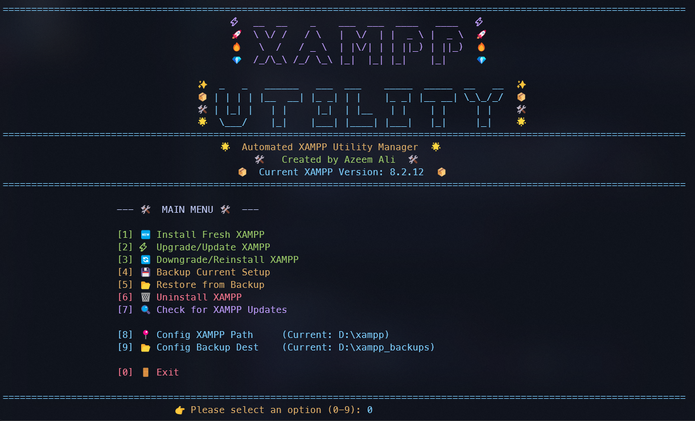

<div align="center">

# 🚀 Automated XAMPP Utility Manager


_A beautiful, interactive Text User Interface (TUI) script for safely and efficiently managing your XAMPP server environments._

</div>

---

## 🌟 Overview

Tired of manually managing your XAMPP installations or dragging your `mysql/data` around when moving environments? **Automated XAMPP Utility Manager** is a comprehensive tool built entirely in PowerShell. It manages the entire lifecycle of your XAMPP installation—from fresh installs and version upgrades to secure backups and restorations—all through an elegant, dynamically-centered terminal interface.

## ✨ Key Features

- **🔍 Auto-Discovery:** Automatically scans your fixed drives to find existing XAMPP installations.
- **📦 Full Lifecycle Management:**
  - **Install:** One-click fresh installation of various XAMPP/PHP versions.
  - **Upgrade/Downgrade:** Safely switch versions with automatic pre-operation backups.
  - **Uninstall:** Secure removal with data protection prompts and "DELETE" string confirmation.
- **💾 Smart Backup & Restore:**
  - Backs up `htdocs`, `mysql\data`, `apache\conf`, and key configuration files (`php.ini`, `my.ini`).
  - Interactive restore menu with detailed backup history.
- **⚡ Fast Interaction:** Single-key navigation (no `Enter` required for menus or Y/N prompts).
- **🎨 Modern TUI:** Dynamic layout with ASCII banners, emoji-rich logs, and terminal-width awareness.
- **🛠️ Integrated Composer:** Option to automatically install Composer during XAMPP setup.
- **📝 Detailed Logging:** Every action is timestamped and logged for easy auditing.

---

## 📸 Preview

<div align="center">
  
  <p><i>The beautifully centered TUI with automated version detection and emoji-rich logging.</i></p>
</div>

---

## 🚀 Getting Started

### Prerequisites

- **Windows OS**
- **PowerShell 5.1+** (Native in Windows 10/11)

### Installation & Usage

#### 🚀 Option 1: Direct Run (Recommended)

Run the script instantly from GitHub:

```powershell
powershell -ExecutionPolicy Bypass -Command "irm https://raw.githubusercontent.com/traximuser20/Xampp-Utility/main/xampp_utility.ps1 | iex"
```

#### 📂 Option 2: Manual Download

1. **Download** [`xampp_utility.ps1`](https://github.com/traximuser20/Xampp-Utility/blob/main/xampp_utility.ps1).
2. **Run the script**:
   ```powershell
   .\xampp_utility.ps1
   ```
3. Use the **Main Menu** for instant actions:
   - `[1] 🆕 Install Fresh XAMPP`
   - `[2] ⚡ Upgrade/Update XAMPP`
   - `[3] 🔄 Downgrade/Reinstall XAMPP`
   - `[4] 💾 Backup Current Setup`
   - `[5] 📂 Restore from Backup`
   - `[6] 🗑️  Uninstall XAMPP`
   - `[7] 🔍 Check for XAMPP Updates`
   - `[8] 📍 Config XAMPP Path`
   - `[9] 📂 Config Backup Dest`
   - `[0] 🚪 Exit`

---

## ⚙️ Configuration

The utility provides built-in configuration options:

- **XAMPP Path:** Manually set or let the script auto-discover it.
- **Backup Destination:** Choose where your compressed `.zip` archives are stored.
- **Version Detection:** The script automatically displays your current XAMPP version in the main banner.

---

## 👨‍💻 Author

Created with ❤️ by **Azeem Ali**

> _"Make server management a habit, not a chore."_

---

<div align="center">
  <i>If you find this utility helpful, consider starring the repository!</i>
</div>
