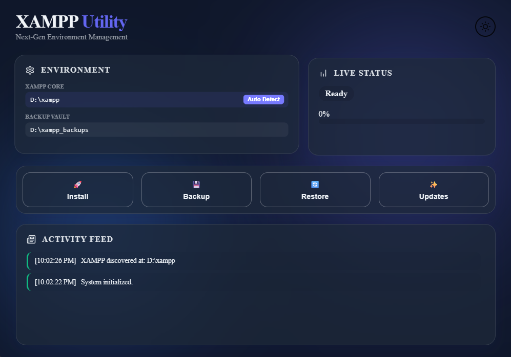

<div align="center">

# 🚀 XAMPP Utility: Next-Gen Environment Manager


_A high-performance, modern Desktop application for safely and efficiently managing your XAMPP server environments._

</div>

---

## 🌟 Overview

**XAMPP Utility** has evolved! Transitioning from a TUI to a full-featured Desktop GUI, this utility combines the speed of **Rust (Tauri)** with the elegance of **Svelte 5**. It provides a "Next-Gen" experience for managing XAMPP installations with a focus on aesthetics, responsiveness, and safety.

## ✨ Key Features

- **🎨 Modern Glassmorphic UI:** A beautiful, transparent interface with vibrant animated backgrounds.
- **🌓 Dark Mode Support:** Full theme synchronization with system preferences and a manual toggle.
- **✨ Fluid Animations:** Smooth Svelte transitions, staggered component entry, and interactive micro-animations.
- **🚀 Animated Splash Screen:** A professional startup sequence for a premium app feel.
- **🔍 Auto-Discovery:** One-click scanning to locate XAMPP installations.
- **📦 Full Lifecycle Management:**
  - **Install:** Automated download and extraction of XAMPP/PHP versions.
  - **Backup & Restore:** High-speed ZIP compression for `htdocs`, `mysql\data`, and configurations.
  - **Updates:** Instant check for the latest XAMPP releases.
- **⚡ Async Architecture:** Powered by **Tokio** and **Tauri Events**, ensuring the UI never freezes during heavy tasks.
- **📜 Live Activity Feed:** A real-time, animated log view to track every operation.

---

## 📸 Preview

<div align="center">
  
  <p><i>The new "Next-Gen" GUI featuring glassmorphism, dark mode, and real-time logs.</i></p>
</div>

---

## 🚀 Getting Started

### Prerequisites

- **Windows OS**
- **Rust Toolchain:** [Install Rust](https://rustup.rs/)
- **Node.js:** [Install Node.js](https://nodejs.org/) (for the Svelte frontend)
- **Tauri Dependencies:** Follow the [Tauri Setup Guide](https://tauri.app/v1/guides/getting-started/prerequisites)

### Installation & Development

1. **Clone the repository:**
   ```bash
   git clone https://github.com/traximuser20/Xampp-Utility.git
   cd Xampp-Utility
   ```
2. **Install frontend dependencies:**
   ```bash
   npm install
   ```
3. **Run in Development Mode:**
   ```bash
   npm run tauri dev
   ```
4. **Build the Production App:**
   ```bash
   npm run tauri build
   ```
   The installer will be located in `src-tauri/target/release/bundle/msi/`.

---

## ⚙️ Project Structure

- **`/src`**: Svelte 5 frontend with modern CSS and animations.
- **`/src-tauri`**: Rust backend handling core logic, file operations, and Tauri commands.
- **`/assets`**: Project icons and preview images.

---

## 👨‍💻 Author

Created by **Azeem Ali**

> _"Blazing fast server management, now with a beautiful face."_

---

<div align="center">
  <i>If you find this utility helpful, consider starring the repository!</i>
</div>
